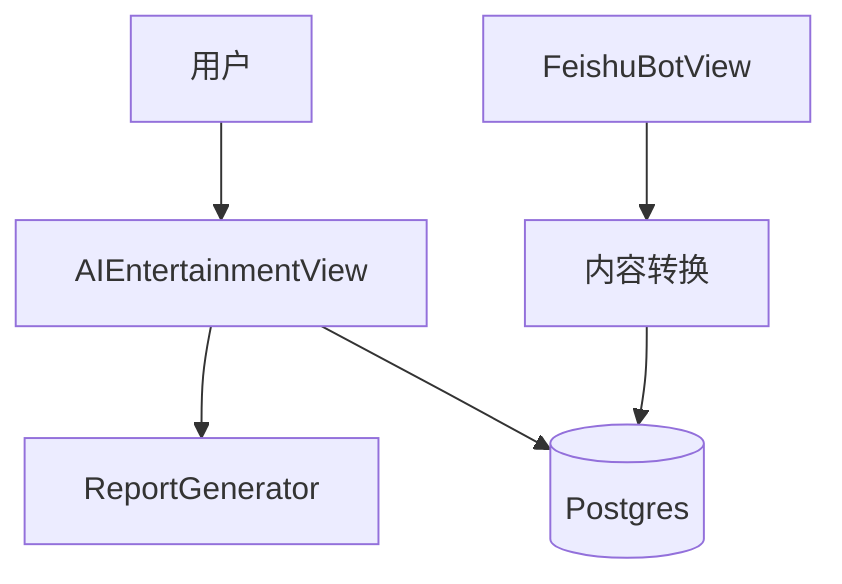

# 技术方案设计文档：AI娱乐与AIGC

## 文档信息
- 作者：系统生成
- 版本：v1.0
- 日期：2025-11-20
- 状态：已确认
- 架构类型：非GBF框架

# 一、名词解释
| 术语 | 解释 |
|------|------|
| AIEntertainmentReport | AI 影视/娱乐报告实体 |
| AIEntertainmentOnlyReport | 独立的AI影视日报报告实体 |
| AIGCReport | AIGC 报告实体 |

# 二、领域模型
- `AIEntertainmentReport/AIEntertainmentOnlyReport/AIGCReport`（参考 `rssant_api/views/ai_entertainment.py:94,208-249` 与 `rssant_api/views/story.py:1211-1250`）。

# 三、应用调用关系

# 四、详细方案设计
## 架构选型
- Controller（AIEntertainmentView/StoryView）→ Service（报告生成与转换）→ Repository（ORM）。

### 分层架构说明
- 视图：`rssant_api/views/ai_entertainment.py:94,208-249`（生成与获取报告）。
- 统一列表与聚合：`rssant_api/views/story.py:1211-1250`。
- 飞书内容列表转换：`rssant_api/views/feishu_bot.py:813-876`。

## 典型接口
- 生成独立AI影视日报：`POST /api/v1/ai_entertainment.only.report.generate`（`rssant_api/views/ai_entertainment.py:94-152`）。
- 获取单个报告：`POST /api/v1/ai_entertainment.report.get`（`rssant_api/views/ai_entertainment.py:208-249`）。
- 统一AI报告列表：`POST /api/v1/ai_summary.list_all`（`rssant_api/views/story.py:808-1250`）。

## 关键规则
- 若报告已存在，优先返回现有记录（幂等）（`rssant_api/views/ai_entertainment.py:94-108`）。
- 内容落库后可作为飞书机器人待发送列表的来源（`feishu_bot.content.list`）。

## 接口改动点
- 当前无协议变更；如支持“搜索引擎切换”，需在生成接口中增加参数（如 `use_tavily` 已支持）。

## 数据库变更
- 无；扩展可考虑持久化“来源链接标题映射”以提升展示质量。