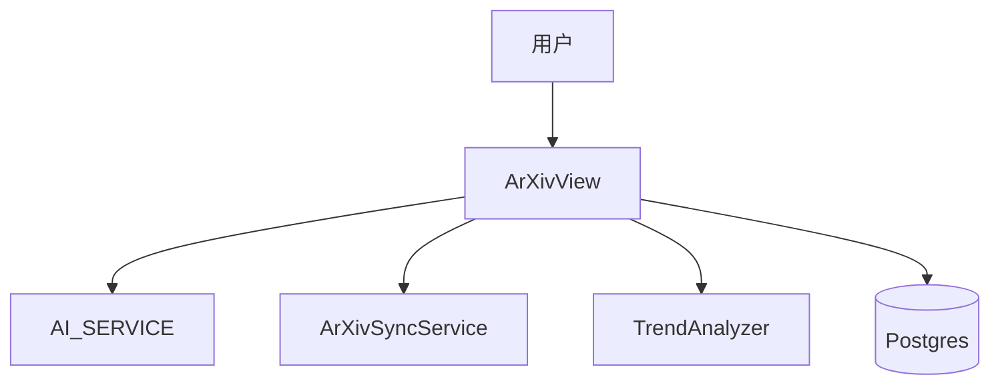

# 技术方案设计文档：ArXiv 功能

## 文档信息
- 作者：系统生成
- 版本：v1.0
- 日期：2025-11-20
- 状态：已确认
- 架构类型：非GBF框架

# 一、名词解释
| 术语 | 解释 |
|------|------|
| ArXivPaper | 论文实体（标题、摘要、作者、分类、时间） |
| ArXivAIAnalysis | 论文AI分析结果（摘要/要点/评分/标签） |
| ArXivReport | 分类/每日报告 |

# 二、领域模型
- `ArXivPaper/ArXivAIAnalysis/ArXivAIAnalysisSummary/ArXivReport`（`rssant_api/views/arxiv.py:1-149`）。

# 三、应用调用关系

# 四、详细方案设计
## 架构选型
- Controller（ArXivView）→ Service（AI分析/报告生成/同步/趋势）→ Repository（ORM）。

### 分层架构说明
- 视图：`rssant_api/views/arxiv.py`。
- 报告生成与下载：`arxiv.report.generate_*` 与 `arxiv.report.download`（`rssant_api/views/arxiv.py:1037-1075`）。

## 典型接口
- 论文列表/详情：`rssant_api/views/arxiv.py:249-314,356-379`。
- AI分析生成：`rssant_api/views/arxiv.py:502-533`。
- 分类报告/每日汇总生成：`rssant_api/views/arxiv.py:652-680,744-771`。
- 报告下载：`GET /api/v1/arxiv.report.download`（`rssant_api/views/arxiv.py:1037-1075`）。

## 关键规则
- 自动保存报告为 AI 分析总结以便统一列表展示（`rssant_api/views/arxiv.py:652-680,744-771`）。
- ArXiv ID 生成 URL 的格式处理（`rssant_api/views/arxiv.py:276`）。

## 接口改动点
- 当前无协议变更；若引入“引文网络图”，需扩展返回结构并提供下载接口。

## 数据库变更
- 无；如支持“引用趋势与期刊影响因子”持久化，可扩展对应模型与字段。