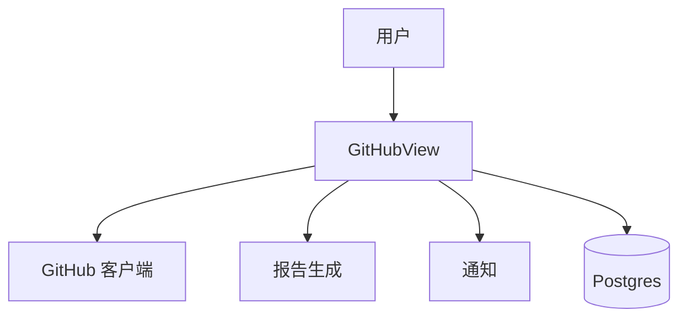

# 技术方案设计文档：GitHub 功能

## 文档信息
- 作者：系统生成
- 版本：v1.0
- 日期：2025-11-20
- 状态：已确认
- 架构类型：非GBF框架

# 一、名词解释
| 术语 | 解释 |
|------|------|
| GitHubSubscription | 用户订阅仓库与频率配置 |
| GitHubProgress | 每日进度（提交/Issue/PR等统计） |
| GitHubReport | 基于进度生成的报告（文本与文件） |

# 二、领域模型
- `GitHubSubscription/GitHubProgress/GitHubReport`（`rssant_api/models/__init__.py:3-15`）。

# 三、应用调用关系

# 四、详细方案设计
## 架构选型
- Controller（GitHubView）→ Service（客户端/报告生成/发现/通知）→ Repository（ORM）。

### 分层架构说明
- 视图：`rssant_api/views/github.py:1`。
- 报告生成：`github.report.generate`（`rssant_api/views/github.py:374-504,486`）。

## 典型接口
- 生成报告：`POST /api/v1/github.report.generate`（`rssant_api/views/github.py:374-504`）。
- 报告列表：`POST /api/v1/github.report.list`（`rssant_api/views/github.py:516-567`）。
- 订阅与发现：参考 `GitHubDiscoveryService` 等服务。

## 关键规则
- 当指定日期无进度，尝试回溯近7天数据（`rssant_api/views/github.py:394-412`）。
- 报告模型标注 `model_name/model_version`，便于溯源。

## 接口改动点
- 当前无协议变更；如支持“企业版GitHub”，需扩展认证与数据源选择参数。

## 数据库变更
- 无；如支持更精细统计，需要在 `GitHubProgress` 增加维度字段。