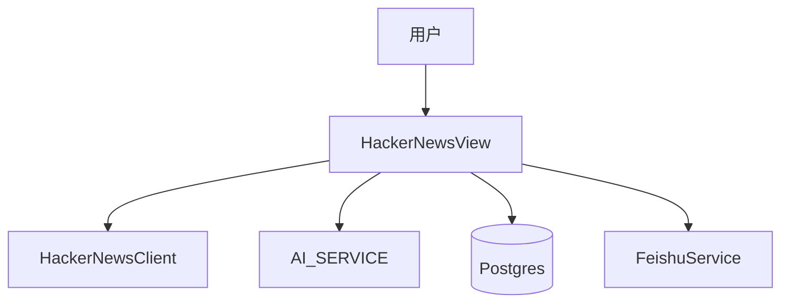

# 技术方案设计文档：Hacker News 功能

## 文档信息
- 作者：系统生成
- 版本：v1.0
- 日期：2025-11-20
- 状态：已确认
- 架构类型：非GBF框架

# 一、名词解释
| 术语 | 解释 |
|------|------|
| HackerNewsStory | HN 文章实体（标题、URL、积分、评论等） |
| AIAnalysis/Report | AI 分析与报告实体 |
| Insight | 讨论精华提取功能 |

# 二、领域模型
- `HackerNewsStory`、`HackerNewsAIAnalysis`、`HackerNewsAIAnalysisSummary`、`HackerNewsReport`、`HackerNewsDiscussionInsight`（`rssant_api/models/__init__.py:6-18`）。

# 三、应用调用关系

# 四、详细方案设计
## 架构选型
- Controller（HackerNewsView）→ Service（客户端/分类器/报告生成/精华提取）→ Repository（ORM）。

### 分层架构说明
- 视图：`rssant_api/views/hacker_news.py:1` 提供查询、分析、报告与导出接口。
- 服务：`HackerNewsClient/HN_CLASSIFIER/HN_REPORT_GENERATOR/HN_INSIGHT_EXTRACTOR`。

## 典型接口
- 列表/详情/分析总结/报告等接口（参考 `rssant_api/views/hacker_news.py` 各段）。
- 导出到飞书：`POST /api/v1/hacker_news.story.export_to_feishu`（`rssant_api/views/hacker_news.py:1171-1243`）。

## 关键规则
- AI 分析统一 Schema 与跨源聚合（见 `rssant_api/views/story.py:808-935` 的统一列表接口）。
- 导出文档内容可拼接 AI 分析摘要与要点。

## 接口改动点
- 当前不调整协议；若支持按话题聚合，需要扩展查询过滤与报告生成参数。

## 数据库变更
- 无新增字段；如引入“话题聚类”，需增加话题表与关联。