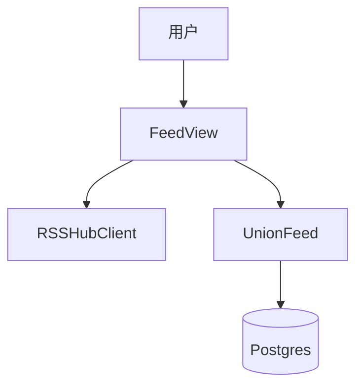

# 技术方案设计文档：RSSHub 集成

## 文档信息
- 作者：系统生成
- 版本：v1.0
- 日期：2025-11-20
- 状态：已确认
- 架构类型：非GBF框架

# 一、名词解释
| 术语 | 解释 |
|------|------|
| RSSHub | 将网站行为转换为可订阅路由的服务 |
| 路由模板 | 如 `/telegram/channel/:username`，需要参数替换 |

# 二、领域模型
- RSSHubClient：路由解析/生成/有效性测试（`rssant_api/services/rsshub_client.py:77,99`）。

# 三、应用调用关系

# 四、详细方案设计
## 架构选型
- Controller（FeedView）→ Service（RSSHubClient）→ 订阅创建逻辑。

### 分层架构说明
- 视图：`rssant_api/views/rsshub.py:1` 注册路由接口；`rssant_api/views/feed.py:413-475` 在导入流程中集成 RSSHub 检查与生成。
- 服务：`get_rsshub_client().generate_feed_url/test_feed_url`。

## 接口与设计
- 获取路由：`GET /api/v1/rsshub.routes`（`rssant_api/views/rsshub.py:14-27`）
- 生成订阅：`POST /api/v1/rsshub.generate`（`rssant_api/views/rsshub.py:42-72`）
- 导入融合：`feed.import` 在 `_create_feeds_by_imports` 中尝试替换为 RSSHub 订阅（`rssant_api/views/feed.py:413-475`）。

## 关键规则
- 仅在启用时生效：`client.is_enabled()`；未启用返回 503。
- 参数替换：模板中 `:param` 与 `params` 一致（`rssant_api/services/rsshub_client.py:77-99`）。
- 有效性测试：`test_feed_url` 确保替换后订阅可用再使用。

## 接口改动点
- 无外部协议字段变更；如后续支持批量生成，需在 `feed.import` 返回中标注转换来源。

## 数据库变更
- 无；实际效果通过 `FeedUrlMap` 与 `FeedCreation` 侧体现。