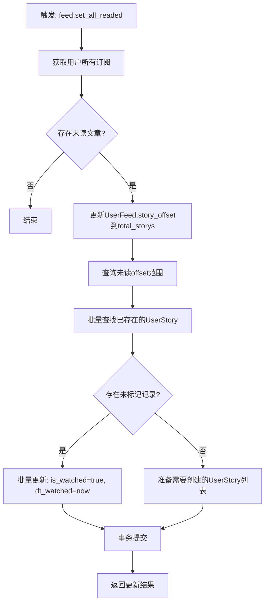
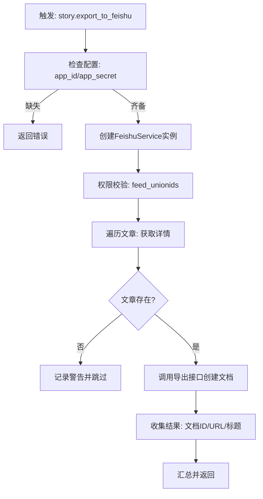
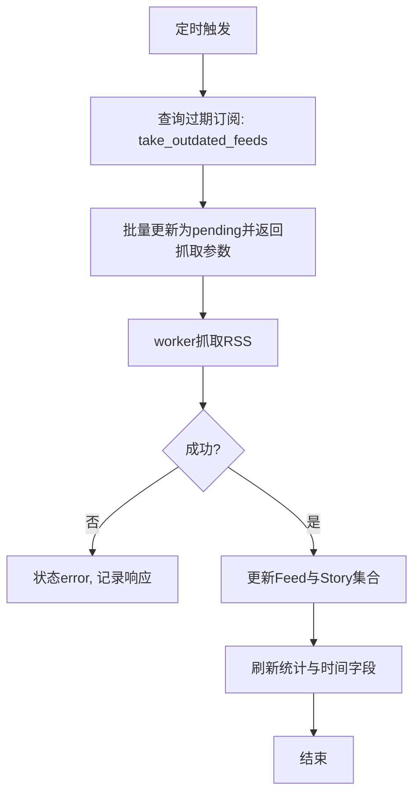

# 业务流程说明

## 全量设为已读流程

- 实现位置：`rssant_api/models/union_feed.py:342`。

## 文章导出到飞书文档流程

- 实现位置：`rssant_api/views/story.py:336`。

## 订阅抓取与更新流程（简化）

- 实现位置：`rssant_api/models/feed.py:246`、`rssant_api/models/story.py:253`。