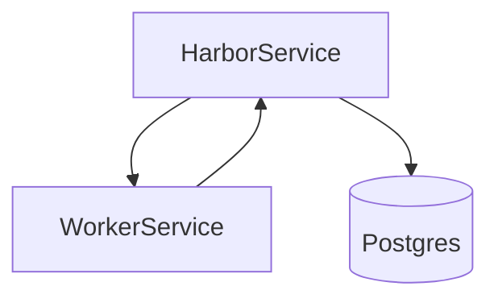

# 技术方案设计文档：全文抓取

## 文档信息
- 作者：系统生成
- 版本：v1.0
- 日期：2025-11-20
- 状态：已确认
- 架构类型：非GBF框架

# 一、名词解释
| 术语 | 解释 |
|------|------|
| fetch_story | 全文抓取任务，根据文章链接拉取页面并提取正文 |
| readability | 正文提取算法与清洗策略 |
| FulltextAcceptStrategy | 用于判断是否接受抓取结果覆盖RSS正文 |

# 二、领域模型
- Story、WorkerTask（全文任务）（`rssant_api/models/__init__.py:1,52`）。

# 三、应用调用关系

# 四、详细方案设计
## 架构选型
- 标准分层：Worker→Harbor→ORM。

### 分层架构说明
- Worker：`rssant_worker/worker_service.py:217-308` 异步抓取网页、解析正文、生成摘要与句子数。
- Harbor：`rssant_harbor/harbor_service.py:291-315` 更新 `Story.content/summary/has_mathjax/sentence_count` 等。

### 数据模型设计
- DTO：`SCHEMA_FETCH_STORY_RESULT`（Worker 返回）。
- DO/PO：`Story` 持久化正文与摘要。

## 流程
1. 任务生成
   - `HarborService._save_fetch_story_task_s`（`rssant_harbor/harbor_service.py:262-275`）。
2. Worker 抓取
   - 处理跳转、解码、大小限制与清洗（`rssant_worker/worker_service.py:217-245,268-308`）。
3. 正文提取
   - 清理HTML→readability→链接处理→句子统计→接受策略（`rssant_worker/worker_service.py:310-341`）。
4. Harbor 更新
   - `harbor_rss.update_story`（`rssant_harbor/view.py:291`）持久化正文/摘要，返回 `accept` 状态。

## 关键规则
- 大小限制：超大内容截断为纯文本（`rssant_worker/worker_service.py:268-308`）。
- 接受策略：非全文内容不覆盖RSS，避免劣化（`rssant_worker/worker_service.py:341`）。

## 接口改动点
- 内部服务：
  - `worker_rss.fetch_story`（`rssant_worker/view.py:51-64`）
  - `harbor_rss.update_story`（`rssant_harbor/view.py:291`）

## 数据库变更
- 无新增字段；如后续引入“正文版本管理”，可扩展 Story 的版本表以支持回滚。