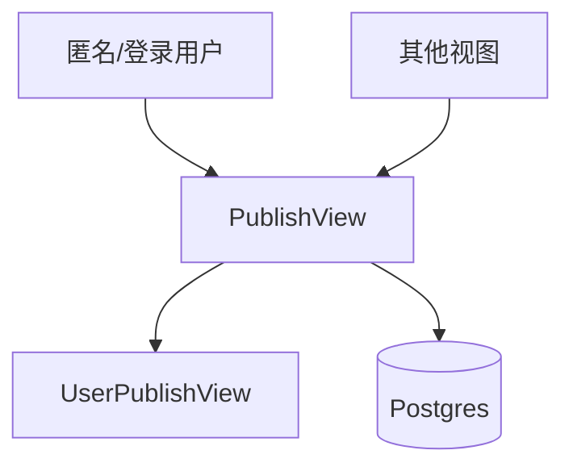

# 技术方案设计文档：发布能力（匿名发布与鉴权）

## 文档信息
- 作者：系统生成
- 版本：v1.0
- 日期：2025-11-20
- 状态：已确认
- 架构类型：非GBF框架

# 一、名词解释
| 术语 | 解释 |
|------|------|
| PublishView | 发布相关的公开接口视图 |
| UserPublish | 用户发布配置（是否开启、根地址、标题、是否全公开） |
| publish_unionid | 发布联合ID（用户与发布ID组合） |

# 二、领域模型
- `UserPublish`（`rssant_api/models/user_publish.py`）。

# 三、应用调用关系

# 四、详细方案设计
## 架构选型
- Controller（PublishView/UserPublishView）→ Service（UserPublish 缓存与解析）→ Repository（ORM）。

### 分层架构说明
- 视图：`rssant_api/views/publish.py:1`（发布信息获取与统一鉴权辅助）；`rssant_api/views/user_publish.py:1`（用户配置读写）。
- 其他视图与发布态：`FeedView.post('publish.feed_get')`（`rssant_api/views/feed.py:230-251`）。

## 接口与设计
- 公开获取发布页面配置：`POST /api/v1/publish.info`（`rssant_api/views/publish.py:17`）
- 用户获取/设置发布配置：`POST /api/v1/user_publish.get/set`（`rssant_api/views/user_publish.py:23-63`）
- 发布态鉴权：
  - 通过请求头 `x-rssant-publish` 或登录态解析发布信息（`rssant_api/views/publish.py:41-88`）。
  - `require_publish_user/is_only_publish` 在相关接口中控制用户身份与可见范围（`rssant_api/views/publish.py:90-98`）。

## 关键规则
- 发布禁用时返回 `is_enable=False`，其他视图在发布态下仅返回公开内容。
- 图片代理信息可下发用于前端渲染（`rssant_api/views/publish.py:25-33`）。

## 接口改动点
- 当前无协议变更；如支持“多站点发布”，需扩展 `UserPublish` 与路由解析逻辑。

## 数据库变更
- 无；如支持多站点与多主题，需要在 `UserPublish` 中增加配置项与索引。