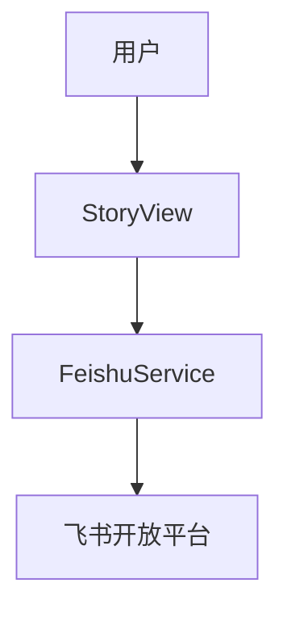

# 技术方案设计文档：文章导出到飞书

## 文档信息
- 作者：系统生成
- 版本：v1.0
- 日期：2025-11-20
- 状态：已确认
- 架构类型：非GBF框架

# 一、名词解释
| 术语 | 解释 |
|------|------|
| FeishuService | 调用飞书API创建文档与内容写入的服务 |
| folder_token | 目标文档目录标识（可选） |

# 二、领域模型
- Story 与其 AI 分析（辅助导出内容组装）。

# 三、应用调用关系

# 四、详细方案设计
## 架构选型
- Controller（StoryView）→ Service（FeishuService）。

### 分层架构说明
- 视图：`rssant_api/views/story.py:334-382`（导出接口）。
- 服务：`rssant_api/feishu_service.py`（创建与写入文档）。

## 接口与设计
- 导出文章到飞书文档：`POST /api/v1/story.export_to_feishu`（`rssant_api/views/story.py:334-382`）
  - 参数：文章列表（feed_id+offset）、`folder_token`、`app_id/app_secret`（可覆盖后端配置）。
  - 行为：校验配置→创建服务→拉取文章详情→组装内容→创建文档并返回结果列表。

## 关键规则
- 配置优先级：前端传入覆盖后端环境变量（`RSSANT_FEISHU_APP_ID/SECRET`）。
- 错误处理：单篇错误不影响整体导出；结果列表中标注失败原因。

## 接口改动点
- 当前无协议字段变更；若支持模板化导出，需要新增模板参数并在接口文档中体现。

## 数据库变更
- 无；导出行为不持久化，仅依赖内容读取与外部接口调用。