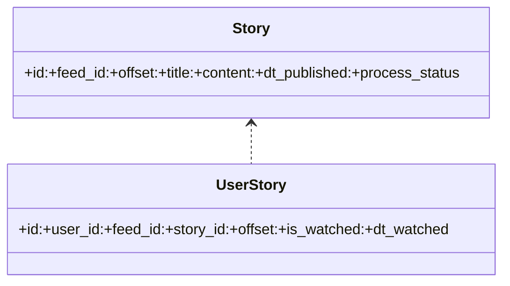
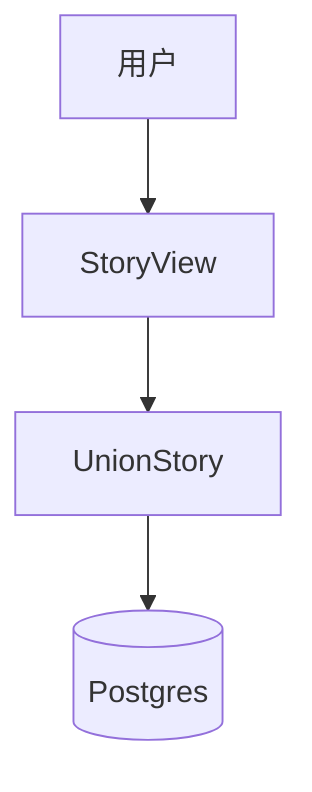

# 技术方案设计文档：文章查询与阅读

## 文档信息
- 作者：系统生成
- 版本：v1.0
- 日期：2025-11-20
- 状态：已确认
- 架构类型：非GBF框架

# 一、名词解释
| 术语 | 解释 |
|------|------|
| Story | 文章实体（标题、链接、正文、摘要、发布时间等） |
| UnionStory | 文章聚合查询对象（按用户维度） |
| UserStory | 用户阅读与收藏标记（是否已读、收藏时间等） |
| StoryDetailSchema | 文章详情字段控制 |

# 二、领域模型
- Story/UnionStory/UserStory（`rssant_api/models/__init__.py:1,47`）

# 三、应用调用关系

# 四、详细方案设计
## 架构选型
- 标准分层：Controller（DRF 视图）→ Service（UnionStory/StoryService）→ Repository（ORM）。

### 分层架构说明
- Controller：`rssant_api/views/story.py`。
- Service：`STORY_SERVICE` 与 `UnionStory` 聚合查询与标记（`rssant_api/models/story_service.py`、`rssant_api/models/union_story.py:344-353`）。
- Repository：`Story`/`UserStory` ORM。

### 数据模型设计
- DTO：`StorySchema` 与列表/批量查询 Schema（`rssant_api/views/story.py:19-49,75,130,155,187`）。
- DO/PO：`Story`、`UserStory`。

## 接口与设计
- 按订阅查询：`POST /api/v1/story.query`（`rssant_api/views/story.py:75`）
- 关键词查询：`POST /api/v1/story.query_by_keyword`（`rssant_api/views/story.py:128-152`）
- 批量查询：`POST /api/v1/story.query_batch`（`rssant_api/views/story.py:155`）
- 详情获取：`POST /api/v1/story.get`（`rssant_api/views/story.py:187`）
- 全量设为已读：通过订阅批处理实现（`rssant_api/models/union_feed.py:342-437`），自动补齐 `UserStory` 标记与时间。

### 阅读标记策略
- 通过 `UserFeed.story_offset` 控制已读边界；批量推进时同步补全 `UserStory`（避免重复查询）。
- 单篇标记：`STORY_SERVICE.set_user_marked(feed_id, offset, is_user_marked=True)`（`rssant_api/models/union_feed.py:415`）。

### 文章导出到飞书（关联）
- `POST /api/v1/story.export_to_feishu`（`rssant_api/views/story.py:334-382`）：接受文章列表与可选凭据，统一生成文档。

### 接口改动点
- 当前无协议变更；如后续增加“高亮区间/批注”，需扩展 `UserStory` 字段与响应结构。

### 代码分层设计
- 视图层：查询与参数校验，按发布态过滤（`rssant_api/views/story.py`、`rssant_api/views/publish.py:61,98`）。
- 服务层：`UnionStory` 与 `STORY_SERVICE` 负责用户维度查询、阅读标记与全文处理辅助。
- 持久层：`Story`/`UserStory` ORM 批量操作与索引。

## 数据库变更
- 本方案不引入新字段；如支持批注/标签，需要扩展 `UserStory` 并更新接口文档。