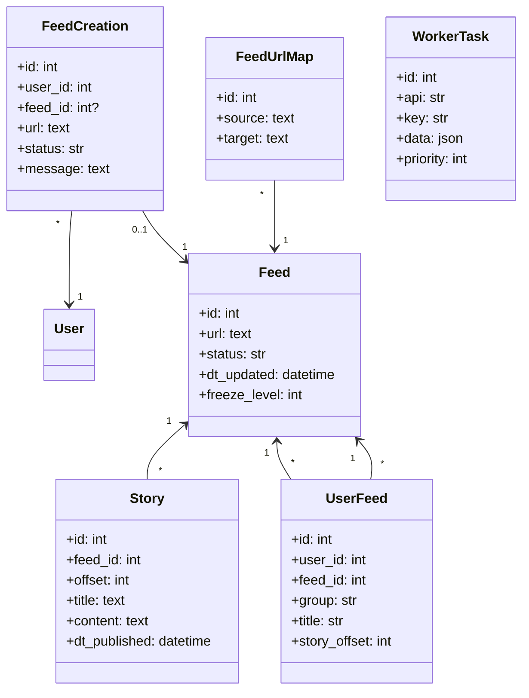
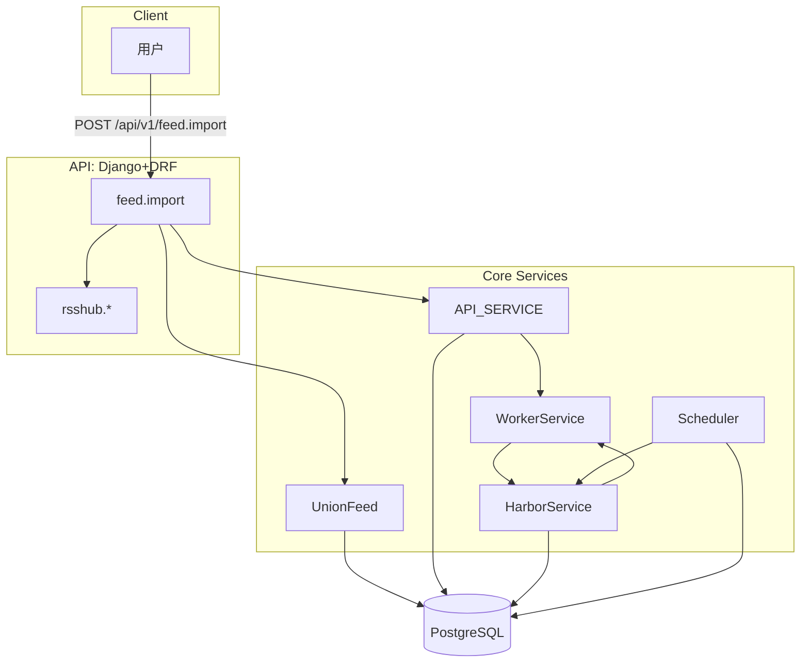
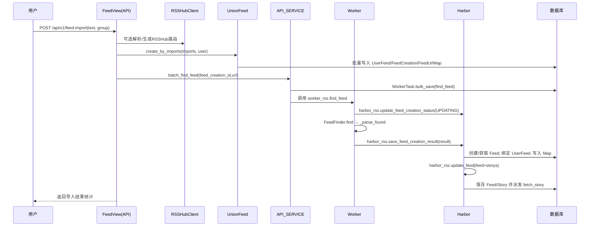

# 技术方案设计文档：订阅导入方案

## 文档信息
- 作者：系统生成
- 版本：v1.0
- 日期：2025-11-20
- 状态：已确认
- 架构类型：非GBF框架

# 一、名词解释
| 术语 | 解释 |
|------|------|
| RSS | 一种订阅协议，用于聚合网站内容（文章、播客等） |
| OPML | 订阅源列表的交换格式，支持批量导入/导出 |
| RSSHub | 开源的订阅生成平台，可将站点行为转换为可订阅源 |
| Feed | 订阅源实体，包含标题、链接、状态、最新文章等 |
| UserFeed | 用户对订阅源的绑定，包含用户个性化信息（分组、标题、偏移） |
| FeedCreation | 订阅创建记录，用于未直达匹配时的发现流程与状态追踪 |
| FeedUrlMap | 源地址与供稿地址映射，解决重定向与去重问题 |
| Story | 订阅源的文章实体，包含正文、摘要、发布时间等 |
| WorkerTask | 任务队列实体，承载发现、同步、全文抓取等任务 |
| Harbor | 后端持久化与派发服务（保存结果、派生任务） |
| Worker | 抓取与解析服务（发现源、同步内容、抓取全文） |
| Scheduler | 调度服务（重试、定期同步、保洁） |

# 二、领域模型
## 核心实体
- Feed：订阅源基本信息与抓取状态（`rssant_api/models/feed.py:82`）。
- UserFeed：用户与订阅的关系，含分组、发布态与阅读偏移（`rssant_api/models/feed.py:82`）。
- FeedCreation：创建任务与状态机（PENDING/UPDATING/READY/ERROR）（`rssant_api/models/feed_creation.py:14`）。
- FeedUrlMap：源地址与供稿地址的映射表（`rssant_api/models/feed_creation.py:123`）。
- Story：文章实体与处理状态（`rssant_api/models/story.py:253`）。
- WorkerTask：任务实体（find_feed/sync_feed/fetch_story 等）。

## 实体关系


# 三、应用调用关系
## 系统架构图


## 时序图


# 四、详细方案设计
## 架构选型
- 标准分层架构（非GBF）：DRF 视图为 Controller，Service 层封装业务编排与跨组件交互，Repository 层为 Django ORM，Domain 层为领域模型与规则。

### 分层架构说明
- Controller 层：DRF 视图，处理 HTTP 请求与基础校验（`rssant_api/views/feed.py:513`，`rssant_api/views/rsshub.py:42`）。
- Service 层：
  - `UnionFeed` 聚合与批处理（`rssant_api/models/union_feed.py:472`）。
  - `API_SERVICE` 投递任务（`rssant_api/api_service.py:85`）。
  - `WorkerService` 抓取与解析（`rssant_worker/worker_service.py:90`）。
  - `HarborService` 持久化与任务派生（`rssant_harbor/harbor_service.py:38,118`）。
- Repository 层：Django ORM（Feed/UserFeed/Story/FeedCreation/FeedUrlMap/WorkerTask）。
- Domain 层：模型规则与状态机（如 `FeedCreation` 状态、`Feed` 冻结策略）。

### 数据模型设计
- DTO：接口层数据传输对象（DRF 请求/响应 Schema）。
- BO：服务层聚合对象与校验结构（解析后的 feed 与 storys，在 Worker/Harbor 之间传递）。
- DO：领域对象（`Feed`、`UserFeed`、`Story`、`FeedCreation`）。
- PO：持久化对象即 Django Model，与 DO 合一（本项目模型即持久化实体）。

## 应用：订阅导入
### 业务流程
- 从用户文本/文件导入订阅，智能匹配已有订阅并去重，未匹配的进入“发现→持久化→派生全文抓取”的链路。

#### 接口：feed.import
- 接口说明：从 OPML/XML/HTML/文本内容导入订阅。
- 接口路径：POST `/api/v1/feed.import`（`rssant_api/views/feed.py:513`）。
- 请求参数：
```json
{
  "text": "<opml>...</opml>",
  "group": "研发资讯"
}
```
- 返回结果：
```json
{
  "total": 5,
  "num_created_feeds": 3,
  "num_existed_feeds": 1,
  "num_feed_creations": 1,
  "first_existed_feed": {"id": "0140be-..."},
  "created_feeds": [ {"id": "...", "status": "READY"} ],
  "feed_creations": [ {"id": 123, "status": "PENDING"} ]
}
```
- 代码位置：`rssant_api/views/feed.py:513-531`。
- 接口改动点：无（确认字段含义与数量限制 `MAX_FEED_COUNT`）。
- 代码分层设计：Controller→UnionFeed→API_SERVICE→Worker/Harbor。

#### 接口：feed.import_file
- 接口说明：从文件上传导入订阅。
- 接口路径：POST `/api/v1/feed.import_file`（`rssant_api/views/feed.py:534`）。
- 请求参数：`multipart/form-data` 包含文件，`group` 可选。
- 返回结果：同 `feed.import`。
- 代码位置：`rssant_api/views/feed.py:536-542`。
- 接口改动点：无。
- 分层设计：Controller 调用 `feed_import` 复用逻辑。

#### 接口：rsshub.routes
- 接口说明：获取可用的 RSSHub 路由列表与基础地址。
- 接口路径：GET `/api/v1/rsshub.routes`（`rssant_api/views/rsshub.py:14-27`）。
- 响应示例：
```json
{ "routes": ["/telegram/channel/:username"], "base_url": "https://rsshub.app" }
```
- 改动点：无（当未启用返回 503）。

#### 接口：rsshub.generate
- 接口说明：为给定 URL 生成 RSSHub 订阅源并测试有效性。
- 接口路径：POST `/api/v1/rsshub.generate`（`rssant_api/views/rsshub.py:42-72`）。
- 请求参数：
```json
{ "url": "https://t.me/channelname" }
```
- 返回结果：
```json
{
  "supported": true,
  "original_url": "https://t.me/channelname",
  "feed_url": "https://rsshub.app/telegram/channel/channelname",
  "route": "/telegram/channel/:username",
  "params": { "username": "channelname" },
  "is_valid": true
}
```
- 改动点：无。

#### 服务接口：worker_rss.find_feed（内部）
- 说明：根据 `FeedCreation` 的 `url` 抓取与解析订阅。
- 路径：POST `worker_rss.find_feed`（`rssant_worker/view.py:13-24`）。
- 行为：
  - 置状态 `UPDATING`（`rssant_harbor/view.py:167`）。
  - 调用 `FeedFinder.find → _parse_found`（`rssant_worker/worker_service.py:108,176`）。
  - 回传 `harbor_rss.save_feed_creation_result`（`rssant_harbor/view.py:181`）。
- 改动点：无。

#### 服务接口：harbor_rss.save_feed_creation_result（内部）
- 说明：持久化发现结果，创建/绑定 `Feed` 与 `UserFeed`，维护 `FeedUrlMap`。
- 路径：POST `harbor_rss.save_feed_creation_result`（`rssant_harbor/view.py:181`）。
- 行为与代码：`rssant_harbor/harbor_service.py:38-116`。
- 改动点：无。

#### 服务接口：harbor_rss.update_feed（内部）
- 说明：保存 Feed 字段与 Story 集合，并派生全文抓取任务。
- 路径：POST `harbor_rss.update_feed`（`rssant_harbor/view.py:195`）。
- 行为与代码：`rssant_harbor/harbor_service.py:118-173,175-245`。
- 改动点：无。

### 接口文档变更
- 本次方案为现有能力的技术方案梳理，不涉及协议字段变更；接口文档保持现状（参见 `cursor/docs/接口文档.md:1-64`）。

### 代码改动点（实现思路）
- 不涉及代码改动；若后续扩展：
  - 增加 RSSHub 路由缓存与站点适配层，以减少实时路由探测的开销。
  - 在 `UnionFeed.create_by_imports` 增加导入源质量评分，优先使用高质量 URL。
  - 在 `HarborService.update_feed` 增加基于内容哈希的去重策略与冲突解决。

## 数据库变更
### 表结构设计（现状概览）
- `Feed`：`id,url,status,dt_updated,freeze_level,reverse_url,etag,last_modified` 等。
- `UserFeed`：`id,user_id,feed_id,group,title,story_offset,is_publish,dt_updated` 等。
- `FeedCreation`：`id,user_id,feed_id?,url,status,message,title,group,dt_created,dt_updated`。
- `FeedUrlMap`：`id,source,target,dt_created`。
- `Story`：`id,feed_id,offset,title,content,summary,dt_published,process_status`。
- `WorkerTask`：`id,api,key,data,priority,expired_seconds,dt_created`。

```text
变更：本方案无新增/调整字段；如引入“导入源质量评分”，需在 FeedCreation 增加评分字段，并在接口文档中体现。
```

---

## 架构类型识别与适配结论
- 代码未出现 GBF 框架特征（Process/NodeService/DomainService/Ability 等），目录结构与实现符合标准分层架构。
- 方案聚焦非GBF项目的分层与接口实现，扩展点以服务层策略与配置为主。

## 方案落地与后续工作
- 文档已对“订阅导入”端到端进行设计说明，与现有实现一致。
- 后续可按需输出“全文抓取”“全量设为已读”“飞书发布”等技术方案文档，延续本模板与方法论。