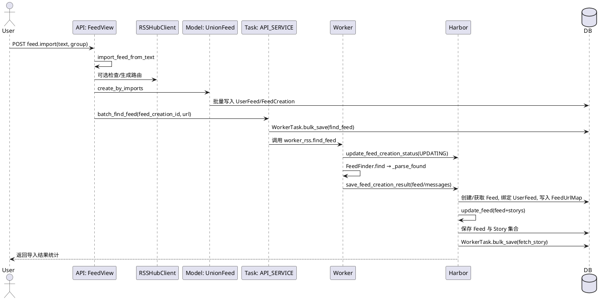

# 订阅导入流程分析

## 功能概述
- 支持从 OPML/书签/HTML/文本内容批量导入订阅来源，自动与已有订阅匹配并去重。
- 对未匹配的来源生成 `FeedCreation` 记录并投递“订阅发现”任务，由 Worker 抓取与解析后端最终形成 `Feed` 与 `UserFeed`。
- 可选集成 RSSHub：对可支持的 URL 自动生成 RSSHub 路由，提高订阅可用性与质量。

## 入口方法
- `rssant_api.views.feed.feed_import`（`rssant_api/views/feed.py:513`）
- 文件上传入口：`rssant_api.views.feed.feed_import_file`（`rssant_api/views/feed.py:534`）

## 方法调用树
```
入口：feed.import（rssant_api/views/feed.py:513）
├─ 解析导入文本：import_feed_from_text（rssant_feedlib/importer.py）
├─ 组装与预处理：_create_feeds_by_imports（rssant_api/views/feed.py:413）
│  ├─ 可选：RSSHubClient 检查/生成订阅（rssant_api/services/rsshub_client.py:77,99）
│  └─ 核心创建：UnionFeed.create_by_imports（rssant_api/models/union_feed.py:472）
│     ├─ 预匹配映射：FeedUrlMap.find_all_target（rssant_api/models/feed_creation.py:123）
│     ├─ 已有订阅：批量创建 UserFeed（rssant_api/models/union_feed.py:544-551,562）
│     └─ 未有订阅：批量创建 FeedCreation（rssant_api/models/union_feed.py:524-531,563）
├─ 投递发现任务：API_SERVICE.batch_find_feed（rssant_api/api_service.py:85,101）
│  └─ WorkerTask.bulk_save（rssant_api/models/worker_task.py）
├─ Worker 接收：WorkerView.do_find_feed（rssant_worker/view.py:9,13）
│  └─ WORKER_SERVICE.find_feed（rssant_worker/worker_service.py:90,131）
│     ├─ 更新创建状态：harbor_rss.update_feed_creation_status（rssant_harbor/view.py:167）
│     ├─ 抓取与解析：FeedFinder.find → _parse_found（rssant_worker/worker_service.py:108,176）
│     └─ 保存结果：harbor_rss.save_feed_creation_result（rssant_harbor/view.py:181）
│        └─ HarborService.save_feed_creation_result（rssant_harbor/harbor_service.py:38,86）
│           ├─ 创建/获取 Feed（rssant_harbor/harbor_service.py:63-79）
│           ├─ 绑定 UserFeed（rssant_harbor/harbor_service.py:93-111）
│           └─ 维护 FeedUrlMap（rssant_harbor/harbor_service.py:112-115）
└─ 后续同步：harbor_rss.update_feed（rssant_harbor/view.py:195）
   └─ HarborService.update_feed → 保存 Feed/Story 并派生全文任务（rssant_harbor/harbor_service.py:118,175,245）
    
调度重试：RssantTaskService._fetch_find_feed_task（rssant_harbor/task_service.py:95）
└─ 针对 PENDING/UPDATING 超时的 FeedCreation 生成重试任务（rssant_harbor/task_service.py:76,95）
```

## 详细业务流程
1. 接收导入内容
   - 参数：`text`（导入文本/OPML/HTML），`group`（可选分组）。入口 `feed_import`（`rssant_api/views/feed.py:516-531`）。
   - 解析：`import_feed_from_text` 将文本解析为 URL 列表与标题字段。
2. RSSHub 辅助（可选）
   - 若启用 RSSHub（`get_rsshub_client().is_enabled()`），对每条 URL：
     - 若为 RSSHub 路由或可支持的站点，生成订阅路由并测试有效性（`rssant_api/services/rsshub_client.py:77,99`）。
     - 将原 URL 替换为 RSSHub 生成的订阅源，提高成功率与稳定性。
3. 订阅创建与匹配
   - 调用 `UnionFeed.create_by_imports`（`rssant_api/models/union_feed.py:472`）：
     - 通过 `FeedUrlMap.find_all_target` 预匹配已存在订阅（`rssant_api/models/feed_creation.py:123`）。
     - 已存在的来源：批量创建 `UserFeed`（避免重复，遵循用户数量限制 `MAX_FEED_COUNT`）。
     - 不存在的来源：批量创建 `FeedCreation`（保留标题与分组信息）并适配冻结级别（`freeze_level`）。
4. 投递 Worker 发现任务
   - 汇总 `feed_creation_id` 与 `url` 列表，调用 `API_SERVICE.batch_find_feed`（`rssant_api/api_service.py:85`），批量保存 `WorkerTask`（find_feed）。
5. Worker 执行“订阅发现”
   - Worker 接口 `worker_rss.find_feed` → `WORKER_SERVICE.find_feed`（`rssant_worker/worker_service.py:90`）：
     - 立即更新创建状态为 `UPDATING`（`rssant_harbor/view.py:167`）。
     - 使用 `FeedFinder` 抓取并尝试解析；失败则记录消息并返回空结果。
     - 将解析结果回传 Harbor：`harbor_rss.save_feed_creation_result`（`rssant_harbor/view.py:181`）。
6. Harbor 入库与绑定
   - `HarborService.save_feed_creation_result`（`rssant_harbor/harbor_service.py:38`）：
     - 错误结果：设置 `FeedCreation.status=ERROR`，写入消息并建立 `NOT_FOUND` 映射。
     - 成功结果：创建或获取 `Feed`，设置 `READY`，为用户建立 `UserFeed`（保留导入标题与分组），维护 `FeedUrlMap` 映射。
     - 随后触发 `update_feed` 完整入库并保存故事集合（`rssant_harbor/harbor_service.py:118`）。
7. 故事保存与全文派生
   - `update_feed` 将解析出的 Feed 与 Story 集合入库，更新 `reverse_url` 与检查/同步时间（`rssant_harbor/harbor_service.py:118-173`）。
   - 对新文章派发全文抓取任务 `worker_rss.fetch_story`（`rssant_harbor/harbor_service.py:175-245`）。
8. 调度重试与保洁
   - 调度服务定期扫描超时的 `FeedCreation`，生成重试任务（`rssant_harbor/task_service.py:95`）。
   - 提供清理接口删除过期的创建记录与任务（`rssant_harbor/harbor_service.py:346,362,366`）。

## 关键业务规则
- 数量限制：导入条目总数受 `MAX_FEED_COUNT` 限制（`rssant_api/views/feed.py:523`）。
- 去重策略：通过 `FeedUrlMap` 进行源地址与供稿地址映射，避免重复订阅（`rssant_api/models/union_feed.py:484-503`）。
- 标题保留：仅当导入标题与源标题不同才写入 `UserFeed.title`（`rssant_api/models/union_feed.py:536-544`）。
- 冻结与解冻：当订阅处于冻结态，导入后尝试下调冻结级别以允许更新（`rssant_api/models/union_feed.py:520-567`）。
- 状态机：`FeedCreation` 从 `PENDING → UPDATING → READY/ERROR`，并有超时重试（`rssant_harbor/task_service.py:76,95`）。
- 时间字段：`Feed.dt_updated` 由系统设置为当前时间，避免信任 RSS 源时间（`rssant_harbor/harbor_service.py:146-153`）。

## 数据流转
- 输入：
  - `text`（OPML/书签/HTML/文本）、`group`（可选分组）。
  - 业务含义：批量添加订阅源，分组用于用户侧组织订阅。
- 处理：
  - 解析 → RSSHub 辅助（可选） → 已有订阅匹配/新建创建记录 → 投递 Worker 任务 → Worker 抓取与解析 → Harbor 入库与绑定 → 派生全文抓取。
- 输出：
  - `FeedImportResultSchema`：统计数量与首条重复项、`created_feeds` 与 `feed_creations` 列表（`rssant_api/views/feed.py:480-486,526-531`）。

## 扩展点/分支逻辑
- RSSHub 开关：关闭时走原始 URL 流程；开启时尽可能生成 RSSHub 订阅源（`rssant_api/services/rsshub_client.py:77,99`）。
- 已存在订阅：直接创建 `UserFeed` 并返回；未存在订阅：创建 `FeedCreation` 并进入 Worker 发现。
- 发现失败：记录消息并将状态置为 `ERROR`，建立 `NOT_FOUND` 映射以避免重复尝试（`rssant_harbor/harbor_service.py:52-61`）。
- 超时重试：对 `PENDING/UPDATING` 超时的创建记录进行重试（`rssant_harbor/task_service.py:95`）。

## 外部依赖
- RSSHub：用于为特定站点生成稳定的订阅路由，减少直连失败（`rssant_api/views/rsshub.py:42-72`）。
- Worker 服务：负责发现、同步与全文抓取（`rssant_worker/view.py:13,31,51`）。
- Harbor 服务：负责持久化、绑定、派发后续任务（`rssant_harbor/view.py:167,181,195,214`）。
- DNS/代理：统一的 DNS 与代理策略保障抓取稳定性（`rssant_common/dns_service.py:1`）。

## 注意事项
- 导入大量来源（>100）视为书签导入以优化处理（`rssant_api/views/feed.py:525`）。
- 不在仓库中存放任何真实密钥；相关配置通过环境变量加载（参见《项目梳理文档》）。
- 对于订阅重定向与重复合并场景，当前存在保留旧订阅的临时策略，后续需统一合并（`rssant_harbor/harbor_service.py:129-141`）。

## 系统交互图（PlantUML）


## 结合已有文档与一致性说明
- 参考《接口文档》（`cursor/docs/接口文档.md`）：`feed.import` 与相关查询接口位置一致。
- 参考《业务流程说明》（`cursor/docs/业务流程说明.md`）：本流程的“订阅抓取与更新流程”部分已在此文档中按步骤细化并补充 RSSHub 与重试机制。
- 参考《项目梳理文档》（`cursor/docs/项目梳理文档.md`）：架构分层与角色说明与本文分析一致；未发现与代码实现明显不一致之处。

```
附：核心入口方法
- feed.import：rssant_api/views/feed.py:513
- _create_feeds_by_imports：rssant_api/views/feed.py:413
- UnionFeed.create_by_imports：rssant_api/models/union_feed.py:472
- batch_find_feed：rssant_api/api_service.py:85
- do_find_feed：rssant_worker/view.py:13
- WorkerService.find_feed：rssant_worker/worker_service.py:90
- harbor_rss.save_feed_creation_result：rssant_harbor/view.py:181
- HarborService.save_feed_creation_result：rssant_harbor/harbor_service.py:38
- HarborService.update_feed：rssant_harbor/harbor_service.py:118
```