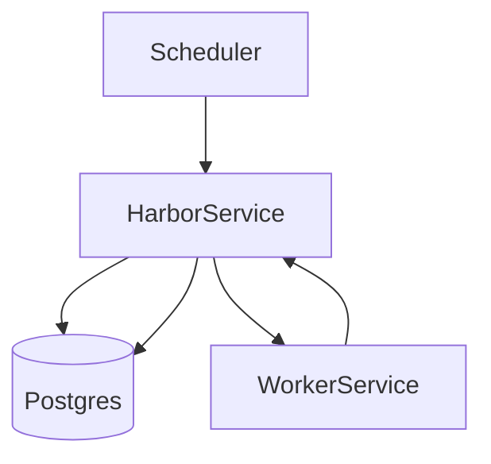

# 技术方案设计文档：订阅抓取与同步

## 文档信息
- 作者：系统生成
- 版本：v1.0
- 日期：2025-11-20
- 状态：已确认
- 架构类型：非GBF框架

# 一、名词解释
| 术语 | 解释 |
|------|------|
| sync_feed | 订阅同步任务，定期抓取RSS并更新Feed与Story |
| Harbor | 保存抓取结果与派生任务的服务 |
| Worker | 抓取与解析服务 |
| Scheduler | 调度服务，生成待处理任务与重试 |

# 二、领域模型
- Feed、RawFeed、Story、WorkerTask（`rssant_api/models/__init__.py:1,52`）。

# 三、应用调用关系

# 四、详细方案设计
## 架构选型
- 标准分层：调度（Scheduler）→ Worker → Harbor → ORM。

### 分层架构说明
- 调度：`rssant_harbor/task_service.py:49-74,95` 根据过期/超时生成 `worker_rss.sync_feed/find_feed` 任务。
- Worker：`rssant_worker/worker_service.py:165-215` 抓取与解析，调用 Harbor 更新。
- Harbor：`rssant_harbor/harbor_service.py:118-173` 更新 Feed 字段与时间、保存 Story 集合。

### 数据模型设计
- DTO：`FeedInfoSchema` 与 `FeedSchema`（Harbor 接口）。
- DO/PO：`Feed`、`RawFeed`、`Story`、`WorkerTask`。

## 流程
1. 选取过期订阅
   - `Feed.take_outdated_feeds` → `task_service._fetch_sync_feed_task`（`rssant_harbor/task_service.py:49`）。
2. 下发同步任务
   - 生成 `worker_rss.sync_feed` 任务（`WorkerTask.from_dict`）。
3. Worker 抓取与解析
   - 走代理与DNS策略，抓取后 `FeedParser` 解析成 Feed+Storys（`rssant_worker/worker_service.py:165-215,376-455`）。
4. Harbor 入库
   - `harbor_rss.update_feed`：更新 Feed 字段与时间、校正 `reverse_url`、保存 Story 集合（`rssant_harbor/harbor_service.py:118-173`）。
5. 派生全文任务
   - 生成 `worker_rss.fetch_story` 任务（`rssant_harbor/harbor_service.py:175-245,262-275`）。

## 关键规则
- 时间字段：`dt_updated` 使用系统当前时间，不信任源内时间（`rssant_harbor/harbor_service.py:146-153`）。
- 重定向与重复：若 URL 改变，尝试保留旧订阅并写映射，避免误合并（`rssant_harbor/harbor_service.py:129-141`）。
- 保洁：过期创建记录与任务定期清理（`rssant_harbor/harbor_service.py:346,362,368`）。

## 接口改动点
- 无对外协议变更；内部服务路径：
  - `worker_rss.sync_feed`（`rssant_worker/view.py:26-46`）
  - `harbor_rss.update_feed`（`rssant_harbor/view.py:195`）
  - `harbor_rss.update_feed_info`（`rssant_harbor/view.py:214`）

## 数据库变更
- 无新增字段；如后续增加“增量校验基线”，可持久化 `checksum_data` 历史版本以优化比对。