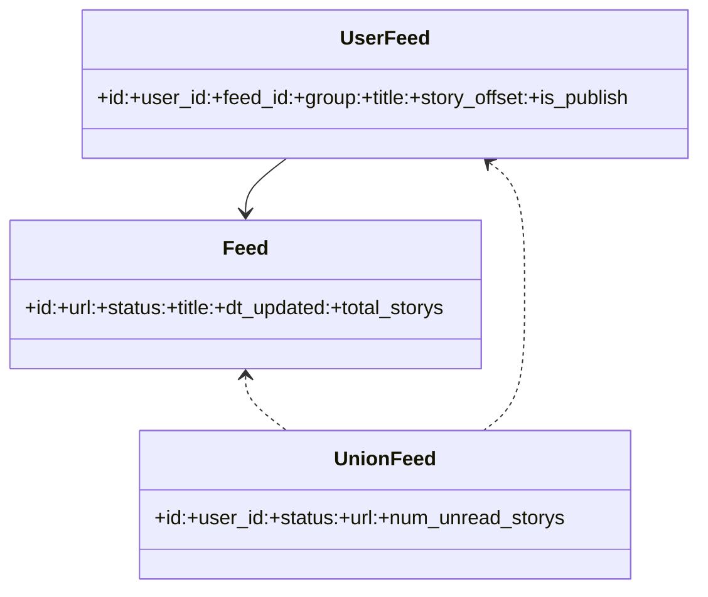
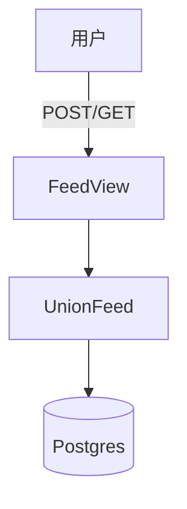

# 技术方案设计文档：订阅管理

## 文档信息
- 作者：系统生成
- 版本：v1.0
- 日期：2025-11-20
- 状态：已确认
- 架构类型：非GBF框架

# 一、名词解释
| 术语 | 解释 |
|------|------|
| Feed | 订阅源实体（标题、链接、状态、统计） |
| UserFeed | 用户与订阅源的绑定（分组、标题、发布态、偏移） |
| UnionFeed | 聚合对象，组合 Feed 与 UserFeed 提供统一视图 |
| FeedDetailSchema | 订阅详情字段控制（包含/排除） |
| FeedUnionId | 跨用户的订阅联合ID（user_id+feed_id） |

# 二、领域模型
- Feed（`rssant_api/models/feed.py:82`）
- UserFeed（`rssant_api/models/feed.py:82`）
- UnionFeed（`rssant_api/models/union_feed.py:29`）

# 三、应用调用关系

# 四、详细方案设计
## 架构选型
- 标准分层：Controller（DRF 视图）→ Service（UnionFeed）→ Repository（ORM）。

### 分层架构说明
- Controller：`rssant_api/views/feed.py:1` 注册所有订阅接口。
- Service：`UnionFeed` 实现读写逻辑（`rssant_api/models/union_feed.py:206,292,331,342,440`）。
- Repository：`Feed`/`UserFeed` 模型与查询。

### 数据模型设计
- DTO：`FeedSchema`、`FeedDetailSchema`（`rssant_api/views/feed.py:20,46`）。
- DO/PO：`Feed`、`UserFeed`。

## 接口与设计
- 订阅列表：`POST /api/v1/feed.query`（`rssant_api/views/feed.py:190`）
  - 根据用户返回所有 UnionFeed，支持增量字段控制。
- 订阅详情：`POST /api/v1/feed.get`（`rssant_api/views/feed.py:230-251`）
  - 支持发布态下仅公开项：`PublishView.post('publish.feed_get')`。
- 设置标题：`POST /api/v1/feed.set_title`（`rssant_api/views/feed.py:300-311`）
  - `UnionFeed.set_title` 更新 `UserFeed.title`。
- 设置分组：`POST /api/v1/feed.set_group`（`rssant_api/views/feed.py:314-316`）
  - `UnionFeed.set_group` 更新 `UserFeed.group`。
- 设置发布态：`POST /api/v1/feed.set_publish`（`rssant_api/views/feed.py:324-336`）
  - `UnionFeed.set_publish` 更新 `UserFeed.is_publish`。
- 批量设分组：`POST /api/v1/feed.set_all_group`（代码位置：`rssant_api/models/union_feed.py:331-339`）
- 设置阅读偏移：`POST /api/v1/feed.set_offset`（`rssant_api/models/union_feed.py:293-307`）
  - 仅允许偏移向前（只增不减），越界抛 `FeedStoryOffsetError`。
- 批量设为已读：`POST /api/v1/feed.set_all_readed`（`rssant_api/models/union_feed.py:342-437`）
  - 批量推进 `story_offset`，并补全/更新对应 `UserStory` 标记。
- 删除：`POST /api/v1/feed.delete`（`rssant_api/views/feed.py:377-386`）
  - `UnionFeed.delete_by_id` 按联合ID删除绑定。
- 批量删除：`POST /api/v1/feed.delete_all`（`rssant_api/models/union_feed.py:440-449`）

### 接口改动点
- 当前无协议字段变更；如后续引入“分组层级”，需扩展 `group` 格式并更新接口文档。

### 代码分层设计
- 视图层：参数校验、权限与发布态判断（`rssant_api/views/feed.py`、`rssant_api/views/publish.py:15,61,89`）。
- 服务层：`UnionFeed` 读写、批处理与规则控制。
- 持久层：ORM 批量写入与索引优化（`bulk_create/bulk_update`）。

## 数据库变更
- 本方案无新增字段；若支持分组层级与排序，考虑为 `UserFeed` 增加 `group_path/index_order` 字段并更新接口文档。