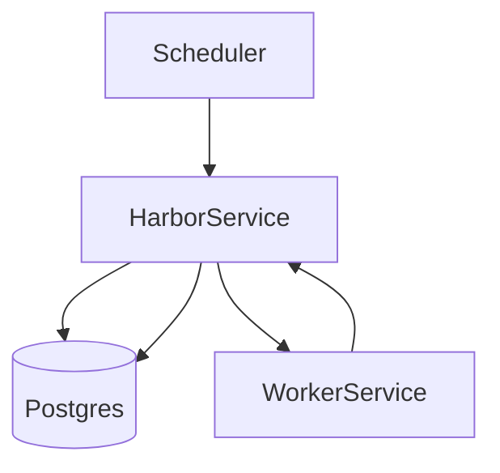

# 技术方案设计文档：调度与任务

## 文档信息
- 作者：系统生成
- 版本：v1.0
- 日期：2025-11-20
- 状态：已确认
- 架构类型：非GBF框架

# 一、名词解释
| 术语 | 解释 |
|------|------|
| Scheduler | 调度服务（aiohttp），周期性生成待处理任务与重试 |
| WorkerTask | 任务实体（api/key/data/priority/expired_seconds） |
| FIND_FEED/SYNC_FEED/FETCH_STORY | 订阅发现/同步/全文抓取任务类型 |

# 二、领域模型
- `WorkerTask`（`rssant_api/models/worker_task.py`）。

# 三、应用调用关系

# 四、详细方案设计
## 架构选型
- Scheduler（生成任务）→ Harbor（派发与持久化）→ Worker（执行）。

### 分层架构说明
- 调度入口：`rssant_scheduler/main.py`（aiohttp 服务与对外 API）。
- 任务服务：`rssant_harbor/task_service.py:33-47,49-74,76-95`（获取/生成/重试与批量保存）。

## 任务策略
- 同步任务：根据 `CONFIG.check_feed_minutes` 选取过期 `Feed`（`rssant_harbor/task_service.py:49`）。
- 发现任务：对 `FeedCreation` 的 `PENDING/UPDATING` 超时进行重试（`rssant_harbor/task_service.py:95`）。
- 过期清理：定期清理过期任务（`rssant_harbor/harbor_service.py:368`）。

## 接口改动点
- 内部服务：`worker_rss.find_feed/sync_feed/fetch_story`（`rssant_worker/view.py:13,26,51`）。
- Harbor 接口：`harbor_rss.update_feed/save_feed_creation_result/update_feed_info`（`rssant_harbor/view.py:181,195,214`）。

## 数据库变更
- 无；如需“任务幂等性增强”，可引入状态机字段与唯一键策略（api+key）。