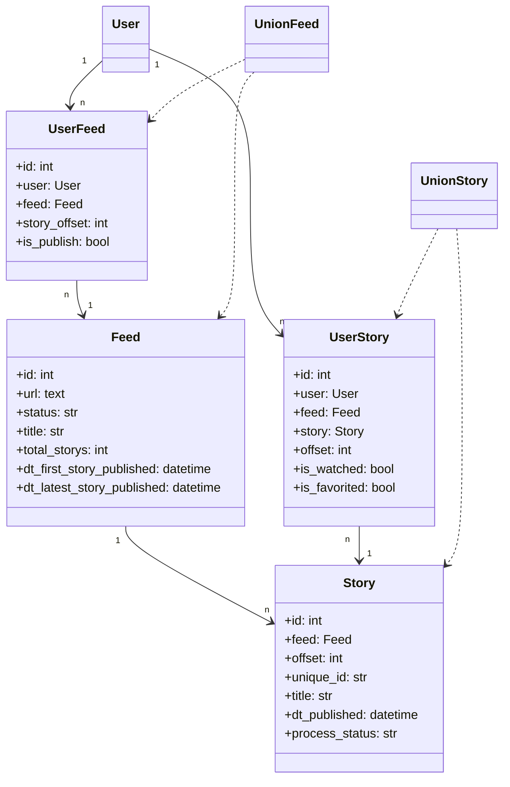

# 领域模型说明

## 概述

- 核心业务概念：`Feed`（订阅）、`Story`（文章）、`UserFeed`（用户订阅映射）、`UserStory`（用户与文章交互）、`UnionFeed/UnionStory`（用户视角聚合模型）。
- 模型位置：`rssant_api/models/` 下的 Django ORM 模型与聚合组件。

## 核心实体关系图

## 模型定义与代码引用

- `Feed` 定义与字段（`rssant_api/models/feed.py:82` 起）
- `Story` 定义与字段（`rssant_api/models/story.py:49` 起）
- `UserStory` 定义与字段（`rssant_api/models/story.py:379` 起）
- `UnionFeed` 用户视角聚合（`rssant_api/models/union_feed.py:29` 起）
- `UnionStory` 用户视角聚合（`rssant_api/models/union_story.py:20` 起）

## 关键业务场景下的模型交互

- 用户查询订阅文章列表：`UnionStory.query_by_feed` 合并 `Story` 与用户交互（`rssant_api/models/union_story.py:278`）。
- 设置订阅阅读进度：`UnionFeed.set_story_offset` 更新 `story_offset`（`rssant_api/models/union_feed.py:293`）。
- 批量设为已读：`UnionFeed.set_all_readed_by_user` 批量生成或更新 `UserStory`（`rssant_api/models/union_feed.py:342`）。

## 数据流转关系

- 订阅抓取更新：`Feed.take_outdated_feeds` 标记待抓取并更新状态（`rssant_api/models/feed.py:246`）。
- 文章刷新统计：`Story.refresh_feed_monthly_story_count` 回填 `Feed.monthly_story_count`（`rssant_api/models/story.py:253`）。

## 属性与约束示例

- `Feed.status` 取值：`pending|updating|ready|error|discard`（`rssant_api/models/feed.py:34`）。
- `Story` 唯一约束：`(feed, offset)` 与 `(feed, unique_id)`（`rssant_api/models/story.py:52`）。
- `UserStory` 唯一约束：`(user, story)`、`(user_feed, offset)`、`(user, feed, offset)`（`rssant_api/models/story.py:381`）。

## 聚合根与边界

- 用户视角的订阅集合由 `UnionFeed` 聚合，负责 `title/group/is_publish/story_offset` 等用户维度信息组合与更新（`rssant_api/models/union_feed.py:309`）。
- 用户视角的文章集合由 `UnionStory` 聚合，负责合并文章详情与用户交互状态（`rssant_api/models/union_story.py:203`）。