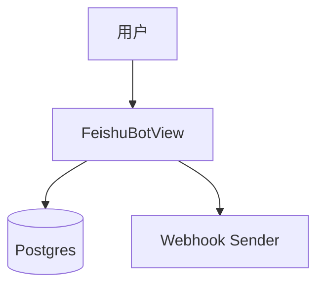

# 技术方案设计文档：飞书机器人配置

## 文档信息
- 作者：系统生成
- 版本：v1.0
- 日期：2025-11-20
- 状态：已确认
- 架构类型：非GBF框架

# 一、名词解释
| 术语 | 解释 |
|------|------|
| FeishuBotConfig | 飞书机器人推送配置（频率、时间、类型、webhook） |
| FeishuStoredReport | 待发送内容存储（摘要与参考链接） |
| FeishuBotSendHistory | 发送历史记录 |

# 二、领域模型
- `FeishuBotConfig`、`FeishuStoredReport`、`FeishuBotSendHistory`（`rssant_api/models/__init__.py:44-51`）。

# 三、应用调用关系

# 四、详细方案设计
## 架构选型
- 标准分层：Controller（FeishuBotView）→ Service（生成/存储/发送）→ Repository（ORM）。

### 分层架构说明
- 视图：`rssant_api/views/feishu_bot.py:1`。
- 发送测试与内容转换：`feishu_bot.test`、`feishu_bot.content.list`（`rssant_api/views/feishu_bot.py:458-577,813-876`）。

## 接口与设计
- 创建配置：`POST /api/v1/feishu_bot.config.create`（`rssant_api/views/feishu_bot.py:31-119`）
- 更新配置：`POST /api/v1/feishu_bot.config.update`（`rssant_api/views/feishu_bot.py:120-230`）
- 删除配置：`POST /api/v1/feishu_bot.config.delete`（`rssant_api/views/feishu_bot.py:231-263`）
- 列表查询：`POST /api/v1/feishu_bot.config.list`（`rssant_api/views/feishu_bot.py:264-326,355`）
- 单条查询：`POST /api/v1/feishu_bot.config.get`（`rssant_api/views/feishu_bot.py:327-409`）
- 发送测试：`POST /api/v1/feishu_bot.test`（`rssant_api/views/feishu_bot.py:410-577`）
- 发送历史：`POST /api/v1/feishu_bot.history.list`（`rssant_api/views/feishu_bot.py:741`）
- 待发送内容：`POST /api/v1/feishu_bot.content.list`（`rssant_api/views/feishu_bot.py:813-876`）

## 关键规则
- `report_type` 仅支持 `ai_entertainment/aigc`，frequency 支持 `daily/weekly`。
- 所有时间返回为 ISO 字符串（视图中进行时区与序列化处理）。
- 发送测试可按配置或类型生成近周期内容，并保存到 `FeishuStoredReport`。

## 接口改动点
- 当前无协议变更；若后续支持更多报告类型，需要扩展 `report_type` 校验与内容转换逻辑。

## 数据库变更
- 无新增字段；如支持“多渠道推送”，可为配置增加 `channel` 与认证信息。