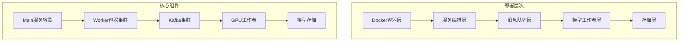

## 系统使用的图像生成模型

该系统支持以下四种主要的图像生成模型：

| 模型名称 | 模型类型 | 配置键 | 主要用途 |
|---------|---------|--------|---------|
| **FLUX** | Flux.1-dev | FLUX | 默认图像生成模型，支持高分辨率输出 |
| **SDXL** | Stable Diffusion XL | SDXL | 高质量图像生成，支持1024x1024分辨率 |
| **SD15** | Stable Diffusion 1.5 | SD15 | 经典图像生成模型，兼容性好 |
| **INSC** | InstantCharacter | INSC | 角色定制生成，支持主体图像参考 |

### 模型配置详情

在 `ai_image_gen/config/settings.py` 中定义了各模型的路径和配置 [1](#0-0) ：

```python
MODEL_CONFIGS = {
    "SDXL": {
        "path": f"{MODEL_CACHE_DIR}/SD_XL/128078/",
        "lora": None
    },
    "SD15": {
        "path": f"{MODEL_CACHE_DIR}/stable-diffusion-v1-5",
        "lora": f"{MODEL_CACHE_DIR}/stable-diffusion-v1-5_loras"
    },
    "FLUX": {
        "path": f"{MODEL_CACHE_DIR}/flux-1-dev",
        "lora": f"{MODEL_CACHE_DIR}/flux-1-dev_loras"
    },
    "INSC": {
        "path": f"{MODEL_CACHE_DIR}/flux-1-dev",
        "lora": f"{MODEL_CACHE_DIR}/flux-1-dev_loras",
        "ip_adapter_path": f"{MODEL_CACHE_DIR}/ipadapter/instantcharacter_ip-adapter.bin",
        "image_encoder_path": f"{MODEL_CACHE_DIR}/google/siglip-so400m-patch14-384",
        "image_encoder_2_path": f"{MODEL_CACHE_DIR}/facebook/dinov2-giant",
    }
}
```

### 模型加载实现

`ModelManager` 类负责动态加载这些模型 [2](#0-1) ：

- **SDXL**: 使用 `AutoPipelineForText2Image`，torch.float16精度
- **SD15**: 使用 `StableDiffusionPipeline`，torch.float16精度  
- **FLUX**: 使用 `DiffusionPipeline`，torch.float16精度
- **INSC**: 使用 `InstantCharacterFluxPipeline`，torch.bfloat16精度，需要额外的适配器初始化

### API中的模型定义

在 `backend_server/schema/utils.py` 中通过枚举定义了支持的模型名称 [3](#0-2) ：

```python
class AIImageModelName(str, Enum):
    FLUX = "flux"
    SD15 = "sd15" 
    SDXL = "SDXL"
```

### 任务分发机制

系统通过Kafka主题将任务分发到对应的模型处理器 [4](#0-3) ：
- `flux_tasks` - FLUX模型任务
- `sdxl_tasks` - SDXL模型任务  
- `sd15_tasks` - SD15模型任务
- `insc_tasks` - INSC模型任务

## Notes

- 系统设计支持动态模型切换和LoRA权重加载，通过 `ModelManager` 实现智能缓存以减少GPU内存占用
- INSC模型是特殊的角色定制模型，需要额外的IP适配器和图像编码器配置
- 所有模型都支持LoRA扩展，除了SDXL当前配置中LoRA路径为None
- 默认情况下，系统优先使用FLUX模型进行图像生成任务


### Citations

**File:** ai_image_gen/config/settings.py (L23-24)
```python
    KAFKA_TOPICS: str = "sdxl_tasks,sd15_tasks,flux_tasks,insc_tasks"
    PRIORITY_KAFKA_TOPICS: str = "online_task"
```

**File:** ai_image_gen/config/settings.py (L29-49)
```python
    MODEL_CONFIGS: dict = {
        "SDXL": {
            "path": f"{MODEL_CACHE_DIR}/SD_XL/128078/",
            "lora": None # SDXL Lora path if applicable
        },
        "SD15": {
            "path": f"{MODEL_CACHE_DIR}/stable-diffusion-v1-5",
            "lora": f"{MODEL_CACHE_DIR}/stable-diffusion-v1-5_loras"
        },
        "FLUX": {
            "path": f"{MODEL_CACHE_DIR}/flux-1-dev",
            "lora": f"{MODEL_CACHE_DIR}/flux-1-dev_loras"
        },
        "INSC": {
            "path": f"{MODEL_CACHE_DIR}/flux-1-dev",
            "lora": f"{MODEL_CACHE_DIR}/flux-1-dev_loras",
            "ip_adapter_path": f"{MODEL_CACHE_DIR}/ipadapter/instantcharacter_ip-adapter.bin",
            "image_encoder_path": f"{MODEL_CACHE_DIR}/google/siglip-so400m-patch14-384",
            "image_encoder_2_path": f"{MODEL_CACHE_DIR}/facebook/dinov2-giant",
        }
    }
```

**File:** ai_image_gen/consumer_worker/model_manager.py (L61-94)
```python
                    if model_name == "sdxl":
                        self.loaded_pipeline = AutoPipelineForText2Image.from_pretrained(
                            final_model_path, torch_dtype=torch.float16, use_safetensors=True,
                            local_files_only=True, # Ensure it looks for local files
                            # The following line is crucial for loading single checkpoint files
                            # It assumes final_model_path points directly to the .safetensors file
                            checkpoint_file=os.path.basename(final_model_path)
                        ).to(device)
                    elif model_name == "sd15":
                        self.loaded_pipeline = StableDiffusionPipeline.from_pretrained(
                            final_model_path, torch_dtype=torch.float16, use_safetensors=False
                        ).to(device)
                    elif model_name == "flux":
                        logger.warning("Flux model loading is a placeholder. Ensure 'flux.py' provides the correct pipeline.")
                        self.loaded_pipeline = DiffusionPipeline.from_pretrained(
                            final_model_path, torch_dtype=torch.float16, use_safetensors=True
                        ).to(device)
                    elif model_name == "insc":
                        from InstantCharacter.pipeline import InstantCharacterFluxPipeline
                        self.loaded_pipeline = InstantCharacterFluxPipeline.from_pretrained(
                            final_model_path, torch_dtype=torch.bfloat16, use_safetensors=True
                        )
                        self.loaded_pipeline.to(device)
                        model_config = self.settings.MODEL_CONFIGS.get("INSC", {})
                        self.loaded_pipeline.init_adapter(
                            image_encoder_path=model_config.get("image_encoder_path"), 
                            image_encoder_2_path=model_config.get("image_encoder_2_path"), 
                            subject_ipadapter_cfg=dict(subject_ip_adapter_path=model_config.get("ip_adapter_path"), nb_token=1024), 
                        )
                    else:
                        # Attempt to load as a generic pipeline if type is unknown, assuming it's a path
                        self.loaded_pipeline = DiffusionPipeline.from_pretrained(
                            final_model_path, torch_dtype=torch.float16, use_safetensors=True
                        ).to(device)
```

**File:** backend_server/schema/utils.py (L28-43)
```python
class AIImageModelName(str, Enum):
    FLUX = "flux"
    SD15 = "sd15"
    SDXL = "SDXL"
    
    @classmethod
    def is_flux(cls, value: str) -> bool:
        return value == cls.FLUX.value
    
    @classmethod
    def is_sd15(cls, value: str) -> bool:
        return value == cls.SD15.value
    
    @classmethod
    def is_sdxl(cls, value: str) -> bool:
        return value == cls.SDXL.value
```


## 项目模型部署架构

该项目采用**分布式容器化部署**架构，通过Docker和Kafka实现模型的弹性部署和管理。

### 整体部署架构



### 1. Docker容器化部署

项目使用Docker Compose进行服务编排，分为两个主要部署文件 [1](#1-0) ：

**Main服务部署**：
```bash
docker build -t ai_image_gen .
docker-compose -f docker-compose.main.yml up -d
```

**Worker服务部署**：
```bash
docker-compose -f docker-compose.worker.yml up -d
```

### 2. 模型文件存储部署

模型采用**本地缓存目录**挂载方式部署 [2](#1-1) ：

```python
MODEL_CACHE_DIR: str = "./model_cache"
MODEL_CONFIGS = {
    "SDXL": {"path": f"{MODEL_CACHE_DIR}/SD_XL/128078/"},
    "SD15": {"path": f"{MODEL_CACHE_DIR}/stable-diffusion-v1-5"},
    "FLUX": {"path": f"{MODEL_CACHE_DIR}/flux-1-dev"},
    "INSC": {"path": f"{MODEL_CACHE_DIR}/flux-1-dev"}
}
```

**目录挂载配置**：
```yaml
volumes:
  - ./:/app
  - /path/to/model_cache:/app/model_cache
```

### 3. Kafka分布式任务部署

系统通过Kafka主题实现模型任务的分布式分发 [3](#1-2) ：

```python
KAFKA_CONSUMER_GROUP_ID: str = "gpu_worker_group"
KAFKA_TOPICS: str = "sdxl_tasks,sd15_tasks,flux_tasks,insc_tasks"
PRIORITY_KAFKA_TOPICS: str = "online_task"
```

### 4. GPU工作者部署

每个Worker容器绑定特定GPU，通过消费者组实现自动负载均衡 [4](#1-3) ：

```python
class ConsumerWorker:
    def __init__(self):
        self.model_manager = ModelManager()
        self.image_generator = ImageGenerator(self.model_manager)
        self.consumer_group_id = settings.KAFKA_CONSUMER_GROUP_ID
```

### 5. 模型动态加载部署

`ModelManager`负责运行时模型的动态加载和内存管理 [5](#1-4) ：

```python
def load_model_and_loras(self, model_path_or_url: str, model_name: str, loras):
    # 智能缓存检查
    if self.loaded_model_name == model_name and self._are_loras_loaded(loras):
        return self.loaded_pipeline
    
    # GPU内存优化
    if self.loaded_pipeline and self.loaded_model_name != model_name:
        self.loaded_pipeline.to("cpu")
        torch.cuda.empty_cache()
```

### 6. 独立Flux服务器部署

项目还包含独立的Flux模型服务器部署 [6](#1-5) ：

```python
@app.on_event("startup")
async def startup_event():
    global pipe
    pipe = load_pipe()
    if flux.LORA_NAME:
        lora_path = os.path.join(flux.LORAS_BASE_PATH, flux.LORA_NAME+'.safetensors')
        pipe.load_lora_weights(lora_path, adapter_name=lora_name)
```

## 部署流程详解

### 阶段1：环境准备

1. **模型下载**：通过`utils/base_download.py`从Hugging Face下载模型 [7](#1-6) 
2. **目录结构创建**：确保模型缓存目录权限正确
3. **Kafka集群部署**：配置ZooKeeper和Kafka broker

### 阶段2：服务启动

1. **构建镜像**：`docker build -t ai_image_gen .`
2. **启动Main服务**：处理API请求和任务分发
3. **启动Worker集群**：可动态扩展的GPU工作者

### 阶段3：运行时管理

1. **模型热加载**：根据任务需求动态加载模型
2. **内存优化**：自动GPU内存管理和清理
3. **负载均衡**：Kafka消费者组自动分配任务

## 扩缩容部署特性

系统支持**水平弹性扩展** [8](#1-7) ：

- **自动扩容**：监控Kafka队列长度，动态启动Worker实例
- **负载重平衡**：新Worker加入时Kafka自动重新分配分区
- **GPU隔离**：每个Worker绑定独立GPU，避免资源冲突

## Notes

- 项目采用容器化部署，所有依赖通过Docker镜像打包
- 模型文件通过volume挂载，支持本地存储和网络存储
- Kafka消费者组机制实现了Worker的自动发现和负载均衡
- ModelManager的智能缓存策略减少了模型加载开销
- 支持多GPU环境下的并行部署和任务分发


### Citations

**File:** ai_image_gen/README.md (L7-31)
```markdown
### 1. 构建 Docker 镜像

在 `ai_image_gen` 目录下执行以下命令构建 Docker 镜像：

```bash
docker build -t ai_image_gen .
```

### 2. 启动 Main 服务 Docker

主服务负责接收图片上传请求，并将任务发送到 Kafka。只能有一个主服务实例。

```bash
docker-compose -f docker-compose.main.yml up -d
```

### 3. 启动 Worker 服务 Docker

工作节点负责从 Kafka 消费任务，生成图片，并将结果上传回主服务。在配置好 Kafka 后，工作节点可以在不同的机器上启动。

**注意：** 在启动 Worker 服务之前，请确保 Kafka 服务已正确配置并运行。

```bash
docker-compose -f docker-compose.worker.yml up -d
```
```

**File:** ai_image_gen/config/settings.py (L22-24)
```python
    KAFKA_CONSUMER_GROUP_ID: str = "gpu_worker_group"
    KAFKA_TOPICS: str = "sdxl_tasks,sd15_tasks,flux_tasks,insc_tasks"
    PRIORITY_KAFKA_TOPICS: str = "online_task"
```

**File:** ai_image_gen/config/settings.py (L26-49)
```python
    MODEL_CACHE_DIR: str = "./model_cache"
    GENERATED_IMAGES_DIR: str = "./generated_images"
    # Model paths (local or URL)
    MODEL_CONFIGS: dict = {
        "SDXL": {
            "path": f"{MODEL_CACHE_DIR}/SD_XL/128078/",
            "lora": None # SDXL Lora path if applicable
        },
        "SD15": {
            "path": f"{MODEL_CACHE_DIR}/stable-diffusion-v1-5",
            "lora": f"{MODEL_CACHE_DIR}/stable-diffusion-v1-5_loras"
        },
        "FLUX": {
            "path": f"{MODEL_CACHE_DIR}/flux-1-dev",
            "lora": f"{MODEL_CACHE_DIR}/flux-1-dev_loras"
        },
        "INSC": {
            "path": f"{MODEL_CACHE_DIR}/flux-1-dev",
            "lora": f"{MODEL_CACHE_DIR}/flux-1-dev_loras",
            "ip_adapter_path": f"{MODEL_CACHE_DIR}/ipadapter/instantcharacter_ip-adapter.bin",
            "image_encoder_path": f"{MODEL_CACHE_DIR}/google/siglip-so400m-patch14-384",
            "image_encoder_2_path": f"{MODEL_CACHE_DIR}/facebook/dinov2-giant",
        }
    }
```

**File:** ai_image_gen/consumer_worker/worker.py (L27-40)
```python
class ConsumerWorker:
    def __init__(self):
        settings = get_settings()
        self.topics = settings.KAFKA_TOPICS.split(',') +  settings.PRIORITY_KAFKA_TOPICS.split(',')
        self.priority_topics = settings.PRIORITY_KAFKA_TOPICS.split(',')
        self.consumer_group_id = settings.KAFKA_CONSUMER_GROUP_ID
        self.bootstrap_servers = get_kafka_config()['bootstrap_servers']
        self.consumer = None
        self.que_dic = {k:Queue() for k in self.topics }
        self.commit_que = Queue()
        self.priority_consumer = None
        self.model_manager = ModelManager()
        self.image_generator = ImageGenerator(self.model_manager)
        self._connect_kafka()
```

**File:** ai_image_gen/consumer_worker/model_manager.py (L31-54)
```python
    def load_model_and_loras(self, model_path_or_url: str, model_name: str, loras: Optional[List[Dict[str, Any]]] = None):
        """
        Loads a Stable Diffusion model and applies specified Lora(s).
        model_path_or_url can be a local path or a direct download URL.
        """
        device  = "cuda" if torch.cuda.is_available() else "cpu"
        try:

            if self.loaded_model_name == model_name and self._are_loras_loaded(loras):
                logger.info(f"Model '{model_name}' and specified Lora(s) already loaded. Skipping.")
                return self.loaded_pipeline

            logger.info(f"Attempting to load model: {model_name} from {model_path_or_url}")

            # Unload current model if different
            if self.loaded_pipeline and self.loaded_model_name != model_name:
                if self.loaded_pipeline:
                    self.loaded_pipeline.to("cpu") # Move to CPU to free up GPU memory
                del self.loaded_pipeline
                self.loaded_pipeline = None
                self.loaded_model_name = None
                self.loaded_loras = {}
                torch.cuda.empty_cache() # Clear GPU memory

```

**File:** flux_server/main.py (L28-46)
```python
@app.on_event("startup")
async def startup_event():
    """Load the Flux pipeline on application startup."""
    global pipe
    print(f"Loading Flux pipeline")
    pipe = load_pipe()
    global lora_path
    if pipe:
        print("Flux pipeline loaded successfully.")
        # Load all available LoRAs at startup
        if flux.LORA_NAME:
            lora_name = flux.LORA_NAME
            print(flux.LORA_NAME)
            lora_path = os.path.join(flux.LORAS_BASE_PATH, flux.LORA_NAME+'.safetensors')
            print(lora_path)
            if os.path.exists(lora_path):
                pipe.load_lora_weights(lora_path, adapter_name=lora_name)
                pipe.set_adapters(lora_name, flux.LORA_STEP / 100)
                print(f"Loaded LoRA: {lora_name}")
```

**File:** ai_image_gen/utils/base_download.py (L30-49)
```python
def download_model(model_id: str, sub_dir: str):
    """
    下载 Hugging Face 模型到指定子目录
    """
    local_dir = os.path.join(BASE_DOWNLOAD_DIR, sub_dir)
    os.makedirs(local_dir, exist_ok=True) # 确保目录存在

    logger.info(f"Attempting to download model: '{model_id}' to '{local_dir}'")
    try:
        # 使用 snapshot_download 下载整个仓库
        # local_dir_use_symlinks=False 确保所有文件都被复制而不是创建软链接
        # allow_patterns 可以用来过滤下载的文件，例如只下载 .safetensors 和 .json 文件
        snapshot_download(
            repo_id=model_id,
            local_dir=local_dir,
            local_dir_use_symlinks=False,
            # 过滤不需要的大文件，例如训练日志、示例图片等
            # 对于Diffusers模型，通常需要 .safetensors/.bin, .json 文件
            allow_patterns=["*.safetensors", "*.bin", "*.json", "*.txt"]
        )
```

**File:** ai_image_gen/design.md (L135-137)
```markdown
8. 部署方案
Docker Compose： 将 FastAPI 服务、多个消费者工作者实例（可以预先配置或通过脚本启动）、Kafka (包含 ZooKeeper)、MySQL 等组件打包成 Docker 镜像，通过 Docker Compose 进行一键部署，简化环境配置和依赖管理。
Kubernetes： (推荐用于生产环境) 如果未来需要扩展到多张 GPU 卡或更复杂的集群环境，可将应用部署在 Kubernetes 集群中。Kubernetes 原生支持服务的扩缩容、负载均衡、滚动更新和高可用性，与 Kafka 消费者组机制配合良好，可以轻松地根据 Kafka 队列指标自动扩缩容消费者工作者。
```
## OCR服务集成与图像质量控制流程
此codemap展示了项目中OCR服务的完整集成流程，包括HTTP API调用[1a-1e]、在普通图像生成中的质量控制[2a-2e]、以及在角色定制生成中的质量验证[3a-3e]。核心逻辑是通过OCR识别图片中的文字数量来判断AI生成图像的质量是否合格。
### 1. OCR服务调用与配置
展示OCR服务的HTTP API调用机制和环境配置
### 1a. OCR函数定义 (`util.py:10`)
定义图像OCR识别的主函数
```text
def ocr_image(image_path):
```
### 1b. 获取OCR服务地址 (`util.py:11`)
从环境变量读取OCR服务的基础URL
```text
ocr_url_base = os.getenv("OCR_SERVICE_BASE_URL", "")
```
### 1c. 构建OCR请求URL (`util.py:14`)
拼接完整的OCR API端点地址
```text
url = f"{base_url}/ocr/"
```
### 1d. 发送OCR请求 (`util.py:17`)
通过POST请求发送图像文件到OCR服务
```text
response = requests.post(url, files=files)
```
### 1e. 返回OCR结果 (`util.py:20`)
解析并返回JSON格式的OCR识别结果
```text
return response.json()
```
### 2. 图像生成质量检查流程
展示OCR在AI图像生成中的质量控制应用场景
### 2a. 调用OCR检查图片 (`gushi.py:374`)
在图像生成后立即进行OCR质量检查
```text
result = ocr_image(filename)["ocr_result"]
```
### 2b. 初始化文本变量 (`gushi.py:378`)
准备提取OCR识别的文字内容
```text
text = ""
```
### 2c. 提取识别文字 (`gushi.py:380`)
从OCR结果中提取所有识别的文字内容
```text
for x in results:
                if x:
                    text += x[-1][0]
```
### 2d. 质量判断逻辑 (`gushi.py:383`)
文字少于10字符认为图片质量合格，停止重试
```text
if len(text) < 10:
                    break  #
```
### 2e. 触发重试机制 (`gushi.py:386`)
OCR检测到过多文字时触发图像重新生成
```text
print(f"Image generation failed for index {index}. Retrying...")
```
### 3. 角色图像OCR验证
展示在角色定制生成中的OCR质量验证流程
### 3a. 角色图片OCR检查 (`gushi.py:651`)
对生成的角色图像进行OCR质量验证
```text
result = ocr_image(actorpath)["ocr_result"]
```
### 3b. 检查OCR结果有效性 (`gushi.py:653`)
验证OCR服务是否返回了有效结果
```text
if not result or not result[0]:
                print("no result")
```
### 3c. 处理OCR数据结构 (`gushi.py:379`)
安全处理OCR返回的嵌套数据结构
```text
results = [] if not result[0] else result[0]
```
### 3d. 角色图片质量判断 (`gushi.py:660`)
应用相同的10字符阈值判断角色图像质量
```text
if len(text) < 10:
                break  #
```
### 3e. 角色图像重试 (`gushi.py:663`)
角色图像质量不合格时触发重新生成
```text
print(f"Actor Image generation failed. Retrying...")
```
